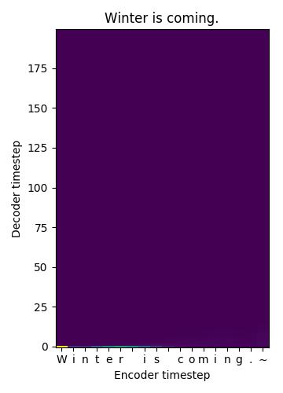
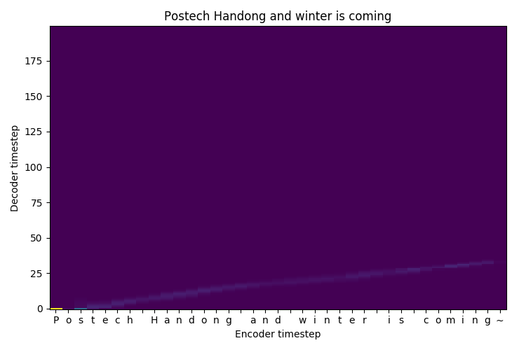

# [OOP 11조 11주차 주간보고서]

> 회의 날짜 : 19.11.15 17:00 ~ 19:30 #6번째 회의 참석자 : 황성민, 전상규, 장경호, 이태희

## Face swap(GAN)

### libstdc++6 compile 문제

### cuDNN 설치

- 빠른 train 속도를 위해 서버 GPU를 사용하기 위해서 설치가 필요하다. 기존에 CUDA는 깔려 있는 것으로 확인되고 cuDNN을 sudo 명령을 통해서 조교님께 부탁드리려고 했지만 설치가 되지 않았다.

**NVIDIA 드라이버 확인**

`nvidia-smi`

**CUDA 버전확인**

` $ cat /usr/local/cuda/version.txt`

**cuDNN 버전확인**

` cat /usr/local/cuda-9.1/include/cudnn.h | grep -E "CUDNN_MAJOR|CUDNN_MINOR|CUDNN_PATCHLEVEL"`

**cuDNN 설치 방법(sudo 권한 없이)**

`conda install -c anaconda cudnn`

위 명령어로 설치가 가능하지만, 패키지로 설치되어 기존에 설치되어 있던 tensorflow의 버전이 변경됨으로 추후에 추가 작업이 필요하다.

 

### [3.train_test 단계]에서 발생하는 Error - 해결

-  OSError: Unable to open file (truncated file: eof = 1089536, sblock->base_addr = 0, stored_eof = 94694792)
  - 같은 폴더에 위치했던 h5 파일들을 삭제하고 다시 다운로드 방법 진행하였지만 동일한 문제 발생
  - **모델을 중복 선언**해주었던 것이 문제.

### TRAIN 속도 문제

- 이후 train이 진행되었으나 CPU를 사용하여 굉장히 **느린 속도**와 개인 노트북으로 접속하다보니 **이동시 인터넷이 끊기는 문제**가 발생하여 추후 청암 컴퓨터로 서버에 접속하여 장시간 train을 시킬 예정
- GPU 사용하여 tensorflow를 빠른 속도로 이용하기 위해 cuDNN은 설치를 완료하였지만, **추가적인 설정이 필요**하다.

## FACESWAP(deepfakes)

* GAN 오픈소스에서 오류가 계속되어, 다른 오픈소스를 추가적으로 진행하기로 함.
* deepfakes: https://github.com/deepfakes/faceswap#how-to-setup-and-run-the-project

### Install

* Anaconda는 이미 서버에 있어 추가적으로 설치하지 않음

* 패키지가 겹치거나 충돌하는 것을 막기 위해 GAN을 진행하던 가상환경 py364와 별개로 python version 3.6의 가상환경 py36을 새로 만듦.

* 오픈소스를 서버에 clone한 뒤 다음 코드로 오픈소스에 필요한 패키지 설치
Install tkinter (required for the GUI) by typing: ' conda install tk '
Install requirements: ' pip install -r requirements.txt '
Install Tensorflow (either GPU or CPU version depending on your setup):
Non GPU Version: ' conda install tensorflow-gpu '

### Extract

* 알맞은 폴더 경로에 얼굴을 추출할 동영상을 저장해두고 다음과 같이 얼굴 추출을 실행할 수 있음

* # To extract Yuna from a video file:
' python faceswap.py extract -i ~/OOP/LTH/faceswap/src/INPUT_VIDEO.mp4 -o ~/OOP/LTH/faceswap/faces/YUNA '

* # To extract Boram from a video file:
' python faceswap.py extract -i ~/OOP/LTH/faceswap/src/boram_video.mp4 -o ~/OOP/LTH/faceswap/faces/BORAM '

### Train

* 다음과 같이 김연아-보람이의 얼굴을 학습하고 둘을 바꿀 수 있는 정보를 담은 모델을 만드는 trian 시작 가능
' python faceswap.py train -A ~/OOP/LTH/faceswap/faces/YUNA -B ~/OOP/LTH/faceswap/faces/BORAM -m ~/OOP/LTH/faceswap/yuna_boram_model/ '

* "Enter" 키를 통해 train 중단 및 저장 가능

* CPU를 활용하여 train을 시켜 50회 정도밖에 train 시키지 못하였음. 추후 GPU 활용하여 model을 만들고 convert 실시해야함.

## Voice Swap

### Train Progress

|  |  |
| ------------------------------------------------------------ | ------------------------------------------------------------ |
| 4,000 train                                                  | 11,000 train                                                 |

* LJSpeech의 목소리를 학습했을 때,첫번째 사진은, 4,000번을, 두 번째는 11,000번을 학습 시킨 후 "winter is coming"이라는 문장을 넣을 때 만들어진 음성을 audio spectrum으로 나타낸 것이다.
* 실제  wav 파일이 만들어진 것을 들어 봤을때도, 첫 번째  학습 모델의 음성은 전혀 알아 들을 수 없었다.  사진에서도 확인이 되듯,  각 문자에 따른 decoder값이 거의 없는 것을 볼 수 있다.
* 반대로,  11,000 번 학습이 된 model은 희미하게 그 decoder 값을 알 수가 있다. 음성에서도 확연한 차이를 볼 수 있다. 실제로 음성을 들었을때,  부드러운 소리라고 할 순 없지만, "Winter is coming"이라는 문장을 말하는 것을 들을 수 있다. 또한, 실제 LJSPeech에서 제공하는 음색과 유사한 것도 인지 할 수 있다.

### 목표

*  첫번째는 앞에서 faceswap team에서 설치한 cudaDNN을 활용하여 GPU를 활용하여 학습 시키는 것이다. 현재까지는 GPU를 활용하지 않고 CPU를 활용하여 학습을 시켰다. 그 11,000 번을 학습 시키는데는 대략 11시간 정도가 걸렸다. 고로 GPU를 활용하는 학습은 분명히 필요하다
* 두번째는, 지금 학습시킨 모델은 single 모델이다. 즉 한 음성의 목소리를 학습하여 text기반으로 책을 읽거나 말을 할때 본인의 말투로 음성을 만드는 것이다. 하지만, 최종 목표는 A라는 아이가 B라는(자신이 되고 싶은 사람) 의  attention을 통하여 본인의 음색으로 이야기 하는 것이다. 고로 multi model을 생성하는 학습을 해야한다.
* 마지막으로는, 현재까니 한국어 data가 없어서 영어 data를 활용하였다. 한국어 data가 필요하기 때문에 음성을 통해 한글로 text file을 만들어주는 프로그램을 찾고, 무엇보다도 한국어로 만들어진 음성 data를 찾아야 한다.
